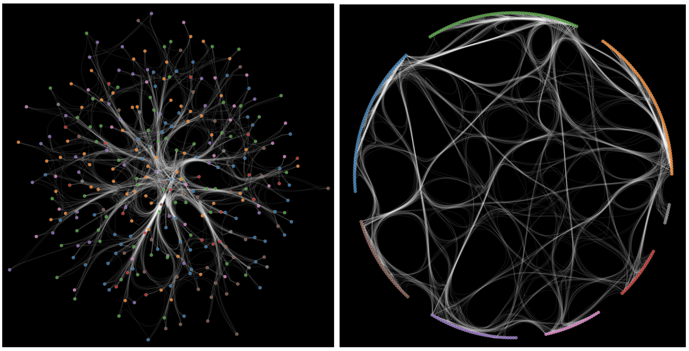

# Edgebundling with bokeh

Interactive edge-bundled network visualization using NetworkX, HoloViews, Bokeh, and Datashader. The script builds a networkx graph, detects communities, places nodes (e.g. in grouped arcs on a circle), applies edge bundling, and saves a standalone HTML with a dark theme. 